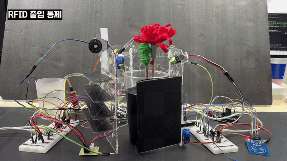
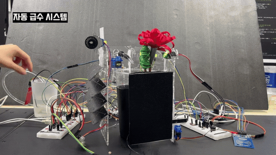
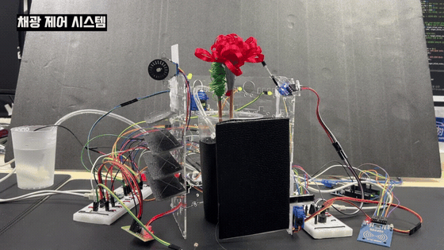

# 🌱 STM32 Smart Farm System

STM32F411 칩을 **베어메탈(Register-level)** 환경에서 C로 구현한 지능형 자동화 스마트팜 시스템입니다. 센서 값을 단순히 읽는 데 그치지 않고 이동 평균 필터, 히스테리시스, 소프트웨어 디바운싱, Non-blocking 상태 머신을 적용해 상용 제품 수준의 안정성을 목표로 개발했습니다.


> 👥 **Team 연구하세용** 팀 프로젝트

**🎥 Full Demo**: [Watch on YouTube](https://youtu.be/RBz_JrHS9yo?si=XU635JR47dcO-_Ry)

<br>

## 📌 1. Project Overview

- **개발 환경:** STM32F411RE (Nucleo-64), GCC ARM Toolchain, Make — HAL 없이 레지스터 직접 제어
- **주요 부품:** 아두이노(RFID 보조), L293D(워터펌프), SG90(서보), ULN2003(스텝모터), 화재/수위/조도 센서, RGB·보조 LED, 피에조 부저
- **핵심 특징:**
  - 타이머(TIM) 기반 Non-blocking 멀티태스킹 — `while(1)`을 멈추지 않고 여러 액추에이터를 동시에 제어
  - UART로 PC 터미널(TeraTerm)에 실시간 센서 대시보드 출력
  - 로직 전원(3.3V)과 모터 전원(5V)을 분리한 견고한 하드웨어 설계

<br>

## 💡 2. Core Features

### 🚪 [1] 보안 출입 통제 (RFID & Servo)
아두이노 RC522가 태그를 인식해 신호를 보내면, STM32가 이를 감지해 서보 도어를 **10ms당 10°씩 Non-blocking으로** 부드럽게 10초간 개방합니다.



### 💧 [2] 자동 급수 및 수위 경보 (Pump & Servo)
수위 센서로 물탱크 잔량을 확인해, 부족하면 부저 경보와 함께 펌프를 강제 차단합니다. 물이 충분하면 지정된 주기마다 L293D로 워터 펌프를 가동하고, 서보로 호스를 **부채꼴로 스윙(Hose Swing)** 시켜 물을 골고루 분사합니다. 수위 판정에는 히스테리시스(1500/1800)를 적용해 경계에서의 반복 오작동을 막았습니다.



### ☀️ [3] 지능형 채광 조절 (Light Sensor & Stepper)
조도 센서 값을 바탕으로 보조 LED 밝기를 3단계로 점진 조절하고, 빛이 과하거나 부족하면 스텝 모터로 블라인드를 자동 개폐합니다. 블라인드 구동선이 엉키지 않도록 수직·대각(X) 교차 설계를 적용했습니다.



### 🔥 [4] 화재 감지 및 비상 대피 (Flame Sensor)
화재 감지 시 모든 시스템(펌프·블라인드)을 즉시 정지하고 문을 강제 개방하며, 적색 LED와 비상 사이렌을 작동합니다. 유저 버튼(PC13)으로 상황을 해제하면 시스템이 재가동됩니다. 상태 표시는 RGB LED로 — 평상시(초록) / 동작 중(파랑 점멸) / 비상(빨강).


<br>

## 🛠️ 3. Troubleshooting (문제 해결 과정)

**1. [HW] 모터 구동 시 시스템 리셋 (전류 기아)**
펌프와 서보를 동시에 구동하면 보드가 다운되거나 서보 홀딩 토크가 풀리며 떨리는 현상 발생. USB 전력(최대 500mA) 한계로 인한 **Brown-out**으로 진단하고, 로직/모터 전원을 분리한 뒤 외부 전원을 인가하고 **GND를 공통으로 묶어(Common GND)** 해결. L293D 채널 쇼트도 파악해 예비 채널로 마이그레이션.

**2. [SW] 센서 채터링(Chattering)**
미세한 빛 변화나 순간 수위 변동에 블라인드·LED·펌프가 반복 오작동. 100ms마다 50개 데이터를 모으는 **이동 평균 필터**로 노이즈를 1차 상쇄하고, On/Off 기준값 사이에 **히스테리시스** 임계값을 둬 불필요한 반복 동작을 차단.

**3. [SW] 화재 센서 노이즈 오작동**
초기 EXTI(외부 인터럽트)로 화재를 감지했으나 정전기·조작 등 미세 노이즈(1us)에도 비상 시스템이 발동됨. EXTI를 제거하고 TIM4(1ms 주기) 인터럽트에서 핀을 폴링하는 **소프트웨어 디바운싱**으로 전환해, **1초 이상 연속 감지될 때만** 비상으로 전환되도록 고도화.

**4. [HW] RFID 신호 불안정**
아두이노 5V 신호를 STM32 5V-tolerant 핀에 직결하자 신호가 튀고 RFID 인식률이 저하됨. 보드 간 직결 시 전류 불안정이 원인임을 파악하고, **전압 분배 회로**로 5V를 3.3V로 낮춰 안정적으로 전달.

<br>

## 🚀 4. Future Improvements

- **IoT 대시보드 확장** — 현재 UART로 터미널에 출력하는 센서 데이터를 ESP8266(Wi-Fi)이나 HC-06(Bluetooth)과 연동해, 웹/스마트폰에서 원격 모니터링·제어할 수 있도록 무선 통신 기능을 추가할 계획입니다.

<br>

## 🗂️ 5. File Structure

```text
STM32_SmartFarm_System
├── System & Core
│   ├── clock.c          # 시스템 코어 클럭(PLL 96MHz) 세팅
│   ├── timer.c          # 하드웨어 타이머 인터럽트 및 PWM 래퍼
│   └── device_driver.h  # 모듈·레지스터 매크로 통합 헤더
├── Application & Logic
│   ├── main.c           # 전체 상태 머신 및 센서/액추에이터 통합 제어
│   └── exception.c      # 화재 디바운싱(TIM4) 및 비상 해제(EXTI13)
├── Hardware Drivers
│   ├── pump.c           # L293D 기반 DC 워터펌프 PWM 제어 (TIM3)
│   ├── servo.c          # 도어 및 급수 호스 서보 제어 (TIM2)
│   ├── step.c           # 블라인드 스텝 모터 제어
│   ├── indicator.c      # RGB·보조 LED 및 부저 제어
│   ├── arduino.c        # 아두이노(RFID) 시리얼 수신
│   ├── adc.c            # 조도/수위 아날로그 데이터 수집 (ADC1)
│   └── uart.c           # 터미널 대시보드 UART 출력
└── Build
    └── Makefile         # GCC ARM Toolchain 원클릭 빌드
```

<br>

## 👥 Credit

**Team 연구하세용** — 권수연, 구동해, 임하리, 문세르, 임용우
STM32F411 기반 스마트팜 자동화 시스템을 5인이 공동 개발했습니다.